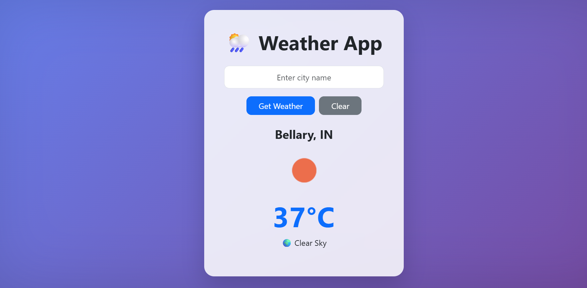

# 🌦 Weather App (React + OpenWeather API)

A simple and responsive Weather Application built using **React.js** and **OpenWeatherMap API**.
Users can search for any city and get real-time weather information such as temperature and weather condition.

---
## ## 🌐 Live Demo

Check out the deployed application here:

👉 **https://weather-app-iota-inky-42.vercel.app**

---
## 🚀 Features

* Search weather by city name
* Real-time weather data from OpenWeather API
* Temperature displayed in Celsius
* Weather condition with icon
* Error handling for invalid city names
* Loading indicator while fetching data
* Clean modern UI with gradient background
* Responsive design using Bootstrap

---

## 🛠 Technologies Used

* React.js
* Vite
* Bootstrap
* OpenWeatherMap API
* CSS

---

## 📦 Installation

Clone the repository

```
git clone https://github.com/msirisha129/weather-app.git
```

Navigate to project folder

```
cd weather-app
```

Install dependencies

```
npm install
```

Run the development server

```
npm run dev
```

Open in browser

```
http://localhost:5173
```

---

## 🌐 API Used

OpenWeatherMap API
https://openweathermap.org/api

---
## 📸 Application Preview



---
## 👩‍💻 Author

**M Sirisha**

---

## 📄 License

This project is for learning and educational purposes.
